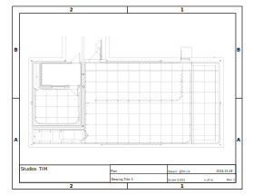

# Studios TIM

## Grand Studio

Comprend un espace principal de 1500 pi² incluant un cyclorama (écran sans coins) de 300 pi² (3 projecteurs laser permettent d’en éclairer la surface.) Le plancher, recouvert d’un tapis, peut-être démonté pour y cacher de l’équipement.

## Petit Studio

Composé de 2 espaces isolés acoustiquement, séparés par une porte et une fenêtre : une partie studio de 300 pi² et une régie de 100 pi². C’est l’endroit idéal pour effectuer des montages audio, des prises de sons ou des enregistrements.

## Plan SVG

## Connectique

* [Étude Connectique PDF](/reference/STUDIOS_TIM_etude_conectique_rev1.pdf)